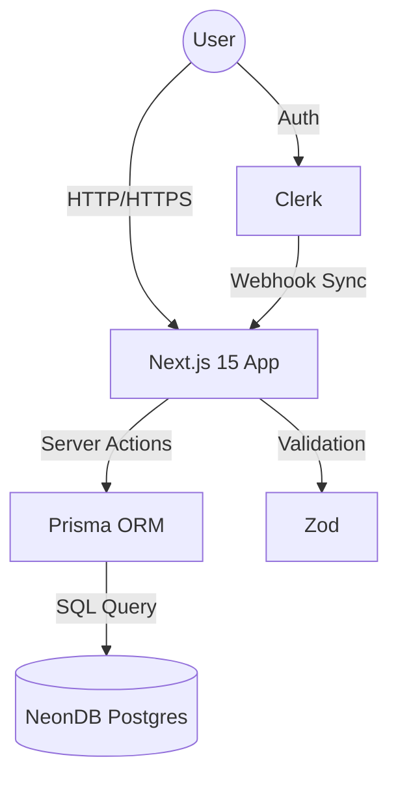
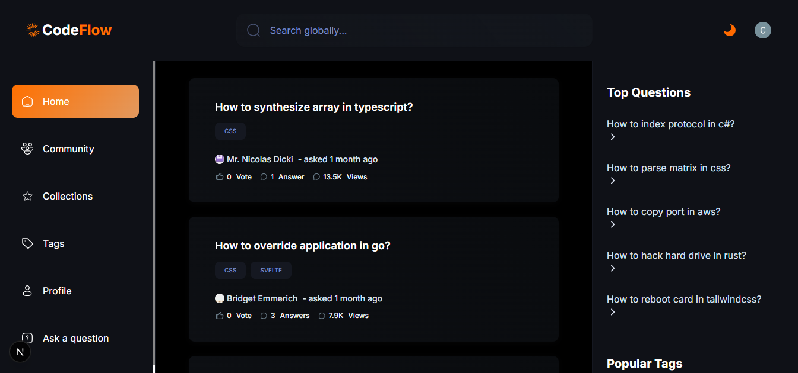

<div align="center">

  <h1>CodeFlow</h1>

  <p><strong>The Intelligent Knowledge-Sharing Platform for Developers</strong></p>

  <div align="center">
    <a href="https://nextjs.org/"></a>
    <a href="https://www.typescriptlang.org/"></a>
    <a href="https://www.docker.com/"></a>
    <a href="https://www.prisma.io/"></a>
    <a href="https://tailwindcss.com/"></a>
    <a href="https://clerk.dev/"></a>
  </div>

  <br />

  <p align="center">
    <a href="https://your-demo-link.com">View Demo</a>
    ·
    <a href="https://github.com/KingsCreatives/codeflow/issues">Report Bug</a>
    ·
    <a href="https://github.com/KingsCreatives/codeflow/issues">Request Feature</a>
  </p>
</div>

<br />

## 🚀 Overview

**CodeFlow** is a community-driven Q&A platform designed for developers to share knowledge, solve problems, and build reputation.

Unlike standard forums, CodeFlow leverages an **intelligent recommendation engine**. By tracking user interactions and tag engagement, the system learns your tech stack (e.g., `React`, `Docker`, `Rust`) to curate a personalized feed. Whether you're debugging a complex distributed system or centering a `div`, CodeFlow surfaces the most relevant solutions for you.


## 🏗 System Architecture

CodeFlow is built on a modern, server-first architecture using Next.js 15 Server Actions for robust data mutations and Clerk for secure identity management.



## ✨ Key Features

### 🧠 Intelligent Recommendations

A custom-built engine analyzes your reading history and interaction patterns to suggest questions that match your expertise.

### ⚡ Global & Local Search

* **Global Search:** Query the entire database for questions, users, or tags.
* **Local Filters:** Sort results dynamically by *Newest*, *Most Frequent*, *Unanswered*, or *Recommended*.

### 💬 Community Interaction

* **Markdown Editor:** Rich text support with syntax highlighting for code blocks.
* **Voting System:** Reputation-based upvote/downvote mechanism.
* **Views & Stats:** Real-time engagement metrics for every question.

### 👤 Developer Profile & Reputation

* **Portfolio Showcase:** Display your bio, location, and links.
* **Gamification:** Earn badges (Bronze, Silver, Gold) and reputation points based on community validation of your answers.


## 🛠 Tech Stack

| Category | Technology | Description |
| --- | --- | --- |
| **Frontend** | Next.js 15 (App Router) | Server Components & Client Components |
| **Styling** | Tailwind CSS & Shadcn UI | Responsive, accessible UI components |
| **Backend** | Server Actions | Server-side mutations without API routes |
| **Database** | PostgreSQL (NeonDB) | Serverless SQL database |
| **DevOps** | Docker | Multi-stage build containerization |
| **ORM** | Prisma | Type-safe database access |
| **Auth** | Clerk | Authentication & User Management |

## Screenshots

<details>
<summary>Home Feed</summary>
<br>


</details>


## 💻 Getting Started

You can run CodeFlow locally using standard Node.js or via Docker.

### Prerequisites

* Node.js `v18+`
* Docker (Optional)
* PostgreSQL database URL
* [Clerk](https://clerk.dev/) account keys

### Environment Setup

Create a `.env` file in the root directory:

```env
# Clerk Auth
NEXT_PUBLIC_CLERK_PUBLISHABLE_KEY=pk_test_...
CLERK_SECRET_KEY=sk_test_...
NEXT_PUBLIC_CLERK_SIGN_IN_URL=/sign-in
NEXT_PUBLIC_CLERK_SIGN_UP_URL=/sign-up

# Database
DATABASE_URL="postgresql://..."

# TinyMCE (Optional)
NEXT_PUBLIC_TINY_EDITOR_API_KEY=...

```

### Option 1: Standard Setup (Node.js)

1. **Install dependencies**
```bash
npm install

```


2. **Initialize Database**
```bash
npx prisma db push
npx prisma db seed

```


3. **Run the server**
```bash
npm run dev

```


### Option 2: Docker Setup 🐳

CodeFlow includes a multi-stage `Dockerfile` optimized for production performance.

1. **Build the image**
```bash
docker build -t codeflow .

```


2. **Run the container**
```bash
docker run -p 3000:3000 --env-file .env codeflow

```


Open [http://localhost:3000](https://www.google.com/search?q=http://localhost:3000) to view the app.

---

## 🤝 Contributing

Contributions are welcomed! Please follow these steps:

1. Fork the repository.
2. Create a new branch: `git checkout -b feature/your-feature-name`.
3. Make your changes and commit them: `git commit -m 'Add some feature'`.
4. Push to the branch: `git push origin feature/your-feature-name`.
5. Submit a pull request.

---


<div align="center">
<sub>Built with ❤️ by <a href="https://github.com/KingsCreatives">KingsCreatives</a></sub>
</div>
